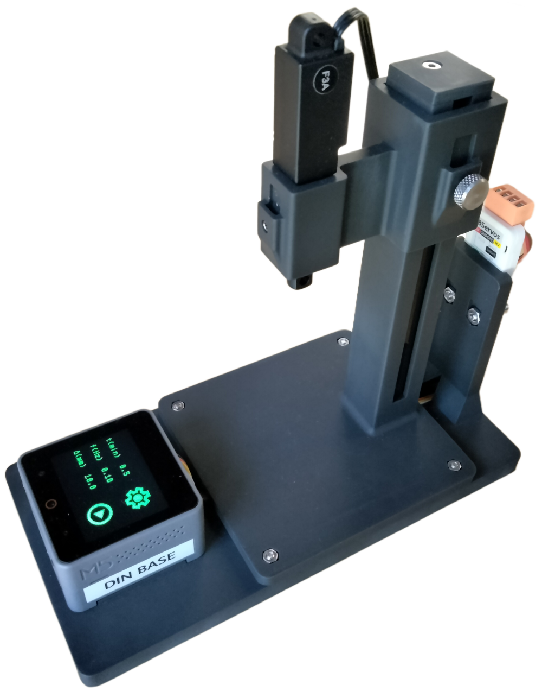

# electrode-etcher-hardware
Hardware design for an automated electrode etcher based on the M5Stack
Core S3 and the Hitec HLS12 linear servo.

# License: 
Creative Commons Attribution 4.0 International CC BY 4.0

Micropython firmeware for the 
[M5Stack Core S3](https://shop.m5stack.com/products/m5stack-cores3-esp32s3-lotdevelopment-kit).
can be found here [electrode-etcher-firmware](https://github.com/willdickson/electrode-etcher-firmware)

